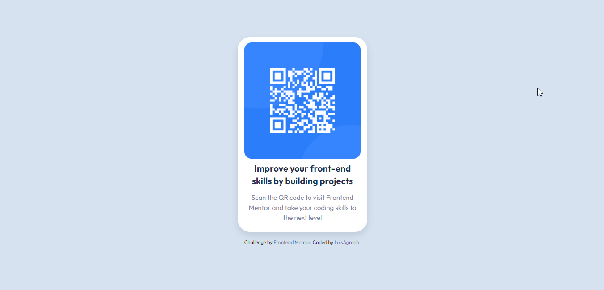

# Frontend Mentor - QR code component solution

This is a solution to the [QR code component challenge on Frontend Mentor](https://www.frontendmentor.io/challenges/qr-code-component-iux_sIO_H). Frontend Mentor challenges help you improve your coding skills by building realistic projects. 

## Overview

### Screenshot

### Links

- Solution URL: [solution URL here](https://github.com/AgredaLuis/qr-code-component)
- Live Site URL: [live site URL here](https://AgredaLuis.github.io/qr-code-component/)

## My process

### Built with

- Semantic HTML5 markup
- CSS custom properties
- Mobile-first workflow
- TypeScript - JavaScript with Syntax for Types.
- [Vite](https://vitejs.dev/) - fast local development server
- [React](https://reactjs.org/) - JS library
- [Tailwind](https://tailwindcss.com//) - For styles

### Continued development

I'm going to keep doing these challenges until I have the confidence and practice to make good designs.

### Useful resources

- [Demystifying the Folder Structure of a React App](https://medium.com/swlh/demystifying-the-folder-structure-of-a-react-app-c60b29d90836) - This helped me to have a more understandable structure for when projects get long.
- [Guide to the Atomic File Structure in React](https://medium.com/@simo-dlamini/a-friendly-guide-to-the-atomic-file-structure-in-react-8bd33e55361c) - This is an amazing article that helped me finally know how to implement pattern design like the compuond component and extensible styles pattern. I'd recommend it to anyone still learning this concept. I really liked this pattern and will use it going forward.

## Author

- Website - [Luis Agreda](https://luisagredadev.vercel.app/)
- Frontend Mentor - [@AgredaLuis](https://www.frontendmentor.io/profile/@AgredaLuis)
- Linkedin - [Luis Agreda](https://www.linkedin.com/in/luisagreda/)
